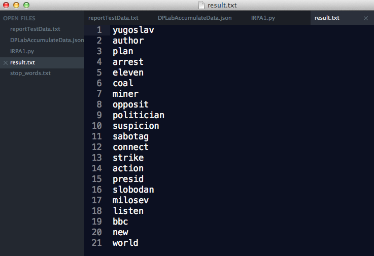

#Information Retrieval Program Assigment 1
###B00705014 資管四 徐育粮
##1. 執行環境
	Mac OS X 10.9.5 with Python 2.7.5
	

##2. 設計
	import re
	import porter_algorithm
	
	p = porter_algorithm.PorterStemmer()
	
	f = open ('IRPA1text.txt', 'r')
	
	stop_words_file = open('stop_words.txt', 'r')
	stop_words = stop_words_file.read().split()
	
	result = re.sub("[^A-Za-z]"," ",f.read().lower()).split()
	stop = filter(lambda x: not(x in stop_words), result) 
	stemmed = map(lambda x: p.stem(x, 0, len(x)-1), stop)
	
	solution = open('result.txt', 'w')
	solution.write('\n'.join(stemmed))
	
	f.close()
	stop_words_file.close()
	solution.close()
1. 載入Porter's algorithm
2. 開啓需要處理的文章
3. 載入stop words list(網路預先下載)，並且將每個字斷開成為一個list
4. 將要處理的文章讀入，用regular expression拿掉非字母符號，小寫化，並且以空白將文章分隔成單字list(tokenization)
5. 將stop word過濾(以filter)
6. 使用porter algorithm處理每一個token(以map)
7. 將處理好的list以換行連接，輸出至檔案

##3. 問題與解決方案
1. 沒有Python開發經驗：不斷的Google
2. 使用Porter algorithm：問同學
3. 演算法設計：使用過去haskell的functional language經驗

##4. 執行結果
Information Retrieval Program Assignment 1 
at [GitHub](https://github.com/iultimatez/IRPA1)

	執行過程無顯示輸出，直接讀入檔案，處理後輸出至result.txt

